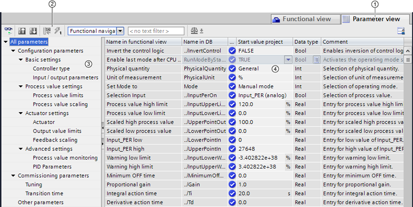
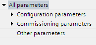
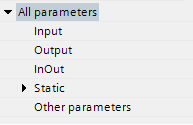

# Configuring a software controller

This section contains information on the following topics:

- [Overview of software controller](#overview-of-software-controller)
- [Steps for the configuration of a software controller](#steps-for-the-configuration-of-a-software-controller)
- [Add technology objects](#add-technology-objects)
- [Configure technology objects](#configure-technology-objects)
- [Call instruction in the user program](#call-instruction-in-the-user-program)
- [Downloading technology objects to device](#downloading-technology-objects-to-device)
- [Commissioning software controller](#commissioning-software-controller)
- [Save optimized PID parameter in the project](#save-optimized-pid-parameter-in-the-project)
- [Working with multi-instance objects](#working-with-multi-instance-objects)
- [Comparing values](#comparing-values)
- [Parameter view](#parameter-view)
- [Display instance DB of a technology object.](#display-instance-db-of-a-technology-object)

## Overview of software controller

For the configuration of a software controller, you need an instruction with the control algorithm and a technology object. The technology object for a software controller corresponds with the instance DB of the instruction. The configuration of the controller is saved in the technology object. In contrast to the instance DBs of other instructions, technology objects are not stored for the program resources, but rather under CPU &gt; Technology objects.

### Technology objects and instructions

| CPU | Library | Instruction | Technology object | Description |
| --- | --- | --- | --- | --- |
| S7-1200 | Compact PID | PID_Compact V1.x | PID_Compact V1.x | Universal PID controller with integrated tuning |
| S7-1200 | PID_3Step V1.x | PID_3Step V1.x | PID controller with integrated tuning for valves |  |
| S7-1500  S7-1200 V4.x | PID_Compact V2.x | PID_Compact V2.x | Universal PID controller with integrated tuning |  |
| S7-1500  S7-1200 V4.x | PID_3Step V2.x | PID_3Step V2.x | PID controller with integrated tuning for valves |  |
| S7-1500 ≥ V1.7  S7-1200 ≥ V4.1 | PID_Temp V1.x | PID_Temp V1.x | Universal PID temperature controller with integrated tuning |  |
| S7-1500 ≥ V3.1 | PID_Compact V3.x | PID_Compact V3.x | Universal PID controller with integrated tuning |  |
| S7-1500/300/400 | PID basic functions | CONT_C | CONT_C | Continuous controller |
| S7-1500/300/400 | CONT_S | CONT_S | Step controller for actuators with integrating behavior |  |
| S7-1500/300/400 | PULSEGEN | - | Pulse generator for actuators with proportional behavior |  |
| S7-1500/300/400 | TCONT_CP | TCONT_CP | Continuous temperature controller with pulse generator |  |
| S7-1500/300/400 | TCONT_S | TCONT_S | Temperature controller for actuators with integrating behavior |  |
| S7-300/400 | PID Self Tuner | TUN_EC | TUN_EC | Optimization of a continuous controller |
| S7-300/400 | TUN_ES | TUN_ES | Optimization of a step controller |  |
| S7-300/400 | Standard PID Control (PID Professional optional package) | PID_CP | PID_CP | Continuous controller with pulse generator |
| S7-300/400 | PID_ES | PID_ES | Step controller for actuators with integrating behavior |  |
| S7-300/400 | LP_SCHED | - | Distribute controller calls |  |
| S7-300/400 | Modular PID Control (PID Professional optional package) | A_DEAD_B | - | Filter interfering signal from control deviation |
| S7-300/400 | CRP_IN | - | Scale analog input signal |  |
| S7-300/400 | CRP_OUT | - | Scale analog output signal |  |
| S7-300/400 | DEAD_T | - | Delay output of input signal |  |
| S7-300/400 | DEADBAND | - | Suppress small fluctuations to the process value |  |
| S7-300/400 | DIF | - | Differentiate input signals over time |  |
| S7-300/400 | ERR_MON |  | Monitor control deviation |  |
| S7-300/400 | INTEG | - | Integrate input signals over time |  |
| S7-300/400 | LAG1ST | - | First-order delay element |  |
| S7-300/400 | LAG2ND | - | Second-order delay element |  |
| S7-300/400 | LIMALARM | - | Report limit values |  |
| S7-300/400 | LIMITER | - | Limiting the manipulated variable |  |
| S7-300/400 | LMNGEN_C | - | Determine manipulated variable for continuous controller |  |
| S7-300/400 | LMNGEN_S | - | Determine manipulated variable for step controller |  |
| S7-300/400 | NONLIN | - | Linearize encoder signal |  |
| S7-300/400 | NORM | - | Scale process value physically |  |
| S7-300/400 | OVERRIDE | - | Switch manipulated variable from 2 PID controllers to 1 actuator |  |
| S7-300/400 | PARA_CTL | - | Switch parameter sets |  |
| S7-300/400 | PID | - | PID algorithm |  |
| S7-300/400 | PUSLEGEN_M | - | Generate pulse for proportional actuators |  |
| S7-300/400 | RMP_SOAK | - | Specify setpoint according to ramp / soak |  |
| S7-300/400 | ROC_LIM | - | Limit rate of change |  |
| S7-300/400 | SCALE_M | - | Scale process value |  |
| S7-300/400 | SP_GEN | - | Specify setpoint manually |  |
| S7-300/400 | SPLT_RAN | - | Split manipulated variable range |  |
| S7-300/400 | SWITCH | - | Switch analog values |  |
| S7-300/400 | LP_SCHED_M | - | Distribute controller calls |  |

## Steps for the configuration of a software controller

All SW-controllers are configured according to the same scheme:

| Step | Description |
| --- | --- |
| 1 | [Add technology object](#add-technology-objects) |
| 2 | [Configure technology object](#configure-technology-objects) |
| 3 | [Call instruction in the user program](#call-instruction-in-the-user-program) |
| 4 | [Download technology object to device](#downloading-technology-objects-to-device) |
| 5 | [Commission software controller](#commissioning-software-controller) |
| 6 | [Save optimized PID parameters in the project](#save-optimized-pid-parameter-in-the-project) |
| 7 | [Comparing values](#comparing-values-1) |
| 8 | [Display instances of a technology object](#display-instance-db-of-a-technology-object) |

## Add technology objects

### Add technology object in the project navigator

When a technology object is added, an instance DB is created for the instruction of this technology object. The configuration of the technology object is stored in this instance DB.

### Requirement

A project with a CPU has been created.

### Procedure

To add a technology object, proceed as follows:

1. Open the CPU folder in the project tree.
2. Open the "Technology objects" folder.
3. Double-click "Add new object".  
   The "Add new object" dialog box opens.
4. Click on the "PID" button.  
   All available PID-controllers for this CPU are displayed.
5. Select the instruction for the technology object, for example, PID_Compact.
6. Enter an individual name for the technology object in the "Name" input field.
7. Select the "Manual" option if you want to change the suggested data block number of the instance DB.
8. Click "Further information" if you want to add own information to the technology object.
9. Confirm with "OK".

### Result

The new technology object has been created and stored in the project tree in the "Technology objects" folder. The technology object is used if the instruction for this technology object is called in a cyclic interrupt OB.

> **Note**
>
> You can select the "Add new and open" check box at the bottom of the dialog box. This opens the configuration of the technology object after adding has been completed.

## Configure technology objects

The properties of a technology object on a S7-1200 CPU can be configured in two ways.

- In the Inspector window of the programming editor
- In the configuration editor

The properties of a technology object on a S7-300/400 CPU can only be configured in the configuration editor.

### Inspector window of the programming editor

In the Inspector window of the programming editor you can only configure the parameters required for operation.

The offline values of the parameters are also shown in online mode. You can only change the online values in the commissioning window.

To open the Inspector window of the technology object, follow these steps:

1. Open the "Program blocks" folder in the project tree.
2. Double-click the block (cyclic interrupt OB) in which you open the instruction of the SW controller.  
   The block is opened in the work area.
3. Click on the instruction of the SW controller.
4. In the Inspector window, select the "Properties" and "Configuration" tabs consecutively.

### Configuration window

For each technology object, there is a specific configuration window in which you can configure all properties.

To open the configuration window of the technology object, follow these steps:

1. Open the "Technology objects" folder in the project tree.
2. Open the technology object in the project tree.
3. Double-click the "Configuration" object.

### Symbols

Icons in the area navigation of the configuration and in the Inspector window show additional details about the completeness of the configuration:

| Symbol | Meaning |
| --- | --- |
|  | **The configuration contains default values and is complete**. The configuration exclusively contains default values. With these default values the use of the technology object is possible without further changes. |
|  | **The configuration contains user-defined or automatically adjusted values and is complete**. All input fields of the configuration contain valid values and at least one default setting was changed. |
|  | **The configuration is incomplete or faulty**. At least one input field or a collapsible list contains no value or an invalid value. The corresponding field or the drop-down list box has a red background. When clicked, the roll-out error message indicates the cause of the error. |

The properties of a technology object are described in detail in the section for the technology object.

## Call instruction in the user program

The instruction of the software controller must be called in a cyclic interrupt OB. The sampling time of the software controller is determined by the interval between the calls in the cyclic interrupt OB.

### Requirement

The cyclic interrupt OB is created and the cycle time of the cyclic interrupt OB is correctly configured.

### Procedure

Proceed as follows to call the instruction in the user program:

1. Open the CPU folder in the project tree.
2. Open the "Program blocks" folder.
3. Double-click the cyclic interrupt OB.  
   The block is opened in the work area.
4. Open the "Technology" group in the "Instructions" window and the "PID Control" folder.  
   The folder contains all instructions for software controllers that can be configured on the CPU.
5. Select the instruction and drag it to your cyclic interrupt OB.  
   The "Call options" dialog box opens.
6. Select a technology object or type the name for a new technology object from the "Name" list.

### Result

If the technology object does not exist yet, it is added. The instruction is added in the cyclic interrupt OB. The technology object is assigned to this call of the instruction.

## Downloading technology objects to device

A new or modified configuration of the technology object must be downloaded to the CPU for the online mode. The following characteristics apply when downloading retentive data:

- **Software (changes only)**

  - S7-1200, S7-1500:   
    Retentive data is retained.
  - S7-300/400:   
    Retentive data is updated immediately. CPU does not change to Stop.
- **Download PLC program to device and reset**

  - S7-1200, S7-1500:   
    Retentive data is updated at the next change from Stop to RUN. The PLC program can only be downloaded completely.
  - S7-300/400:   
    Retentive data is updated at the next change from Stop to RUN.

### Downloading retentive data to an S7-1200 or S7-1500 CPU

> **Note**
>
> The download and reset of the PLC program during ongoing system operation can result in serious damages or injuries in the case of malfunctions or program errors.
>
> Make sure that dangerous states cannot occur before you download and reset the PLC program.

Proceed as follows to download the retentive data:

1. Select the entry of the CPU in the project tree.
2. Select the command "Download and reset PLC program" from the "Online" menu.

   - If you have not established an online connection yet, the "Extended download" dialog opens. In this case, set all required parameters for the connection and click "Download".
   - If the online connection has been defined, the project data is compiled, if necessary, and the dialog "Load preview" opens. This dialog displays messages and recommends actions necessary for download.
3. Check the messages.

   As soon as download is possible, the "Download" button becomes active.
4. Click on "Download".

   The complete PLC program is downloaded and the "Load results" dialog opens. This dialog displays the status and the actions after the download.
5. If the modules are to restart immediately after the download, select the check box "Start all".
6. Close the dialog "Download results" with "Finish".

### Result

The complete PLC program is downloaded to the device. Blocks that only exist online in the device are deleted. By downloading all affected blocks and by deleting any blocks in the device that are not required, you avoid inconsistencies between the blocks in the user program.

The messages under "Info &gt; General" in the Inspector window indicate whether the download was successful.

## Commissioning software controller

### Procedure

To open the "Commissioning" work area of the technology object, follow these steps:

1. Open the "Technology objects" folder in the project tree.
2. Open the technology object in the project tree.
3. Double-click the "Commissioning" object.

The commissioning functions are specific for each controller and are described there.

## Save optimized PID parameter in the project

The software controller is optimized in the CPU. Through this, the values in the instance-DB on the CPU no longer agree with those in the project.

To update the PID parameter in the project with the optimized PID parameters, proceed as follows:

### Requirement

- An online connection to the CPU is established and the CPU is in "RUN" mode.
- The functions of the commissioning window have been enabled by means of the "Start" button.

### Procedure

1. Open the CPU folder in the project tree.
2. Open the "Technology objects" folder.
3. Open a technology object.
4. Double click on "Commissioning".
5. Click on the  icon "Upload PID parameters".
6. Save the project.

### Result

The currently active PID parameters are stored in the project data. When reloading the project data in the CPU, the optimized parameters are used.

## Working with multi-instance objects

If a function block (FB) calls another FB, its instance data can also be saved in the instance DB of the calling FB. This type of block call is referred to as a multi-instance. The PID software controllers support this type of call and can be used as multi-instance.

### Advantages

The use of multi-instances offers the following advantages:

- Good structuring possibility
- Lower number of instance DBs
- Individually configured FBs as template for a software controller than you can instantiate as often as you wish

### Restrictions

When using multi-instances for PID software controllers, the following restrictions are in place compared to using a single instance:

- No support of Openness for PID multi-instance objects
- No comparison of PID multi-instance objects in a comparison editor. Comparison is only possible via the block containing the multi-instance objects.
- No technology object-specific Inspector window of the programming editor for calling the PID_Compact, PID_3Step and PID_Temp instructions

### Configuration of multi-instance objects

The configuration and commissioning of PID multi-instance objects is not opened via the "Technology objects" folder in the project tree, as is the case with single-instance objects. For multi-instance objects, you can find configuration and commissioning in the "Technology objects" tab of the detail view.

To open the configuration of multi-instance objects, follow these steps:

1. Select the FB or instance DB with the multi-instance object in the project tree.
2. Click on the "Technology objects" tab in the detail view.
3. Navigate to the desired multi-instance object.
4. Open the configuration of the multi-instance object.

> **Note**
>
> The configuration editor does not offer online functionality for multi-instance objects in an FB. Instance DBs do not have this restriction.

### Commissioning of multi-instance objects

To open the commissioning of multi-instance objects, follow these steps:

1. Select the instance DB with the multi-instance object in the project tree.
2. Click on the "Technology objects" tab in the detail view.
3. Navigate to the desired multi-instance object.
4. Open the commissioning of the multi-instance object.

This functionality is not available for PID multi-instance objects in FBs.

> **Note**
>
> If PID multi-instance objects are in an array, you can only navigate to these multi-instance objects in the detail view if the number of array elements does not exceed 100. For arrays with more than 100 elements, the individual PID multi-instance objects are not displayed and the editors for configuration and commissioning are not available.

### Example for the use of PID multi-instance objects

To use PID multi-instance objects for your application, you can do the following:

1. Add a function block to your program.
2. Call one or multiple suitable PID controllers with the "Multi-instance" call option in this FB.
3. Add your own application-dependent functionality in the same FB, for example, pre-processing of the setpoint.
4. Select the FB in the project tree and then open the configuration editors of the PID multi-instance objects via the "Technology objects" tab of the detail view.
5. Perform the configuration, which should be identical for all instances of the FB, in the configuration editors.
6. Close the configuration editors.
7. Instantiate the FB as required in the user program so that instance DBs are created.
8. Select one of these instance DBs in the project tree and then open the configuration editors of the PID multi-instance objects via the "Technology objects" tab of the detail view.
9. Perform the configuration, which is individual for this instance DB, in the configuration editors.
10. Close the configuration editors.
11. Repeat steps 8 to 10 for the other instance DBs with PID multi-instance objects.
12. Compile the program, load it into the device and set up an online connection.
13. Select an instance DB that contains PID multi-instance objects in the project tree and then open the commissioning editors of the PID multi-instance objects via the "Technology objects" tab of the detail view.
14. Commission the PID multi-instance objects.
15. Close the commissioning editors.
16. Repeat steps 13 to 15 for the other instance DBs with PID multi-instance objects.

## Comparing values

This section contains information on the following topics:

- [Comparison display and boundary conditions](#comparison-display-and-boundary-conditions)
- [Comparing values](#comparing-values-1)

### Comparison display and boundary conditions

The "Compare values" function provides the following options:

- Comparison of configured start values of the project with the start values in the CPU and the actual values
- Direct editing of actual values and the start values of the project
- Immediate detection and display of input errors with suggested corrections
- Backup of actual values in the project
- Transfer of start values of the project to the CPU as actual values

#### Icons and operator controls

The following icons and operator controls are available:

| Icon | Function |
| --- | --- |
|  | Start value in PLC matches the configured Start value in project |
|  | Start value in PLC does not match the configured Start value in project |
|  | The comparison of the Start value in PLC with the configured Start value in project cannot be performed |
|  | At least one of the two comparison values has a process-related or syntax error. |
|  | Create snapshot of monitor values and accept setpoints of this snapshot as start values |
|  | Load start values of setpoints as actual values (initialize setpoints) |
|  | Opens the "Compare values" dialog |

#### Boundary conditions

The "Compare values" function is available for S7-1200 and S7-1500 without limitations.

The following limitation applies to S7-300 and S7-400:

In monitoring mode, an S7-300/S7-400 cannot transfer the start values to the CPU. These values cannot be displayed online with "Compare values".

The actual values of the technology object are displayed and can be changed directly.

### Comparing values

The procedure is shown in the following using "PID Parameters" as an example.

#### Requirements

- A project with a software controller is configured.
- The project is downloaded to the CPU.
- The configuration dialog is open in the project navigator.

#### Procedure

1. Open the desired software controller in the project navigation.
2. Double-click the "Configuration" object.
3. Navigate within the configuration window to the "PID Parameters" dialog.
4. Click the  icon to activate monitoring mode.

   The [icons and operator controls](#comparison-display-and-boundary-conditions) of the "Compare values" function are shown behind the parameters.
5. Click the desired parameter in the input box and change the parameter values manually by entering them directly.

   - If the background of the input box is gray, this value is a read-only value and cannot be changed.
   - To change the values in the "PID Parameters" dialog, enable manual entry by selecting the "Enable manual entry" check box beforehand.
6. Click the  icon to open the dialog for the start values.

   This dialog indicates two values of the parameter:

   - Start value in CPU: The start value in the CPU is shown in the top part.
   - Start value in the project: The configured start value in the project is shown in the bottom part.
7. Enter the desired value in the input box for the project.

#### Error detection

The input of incorrect values is detected. Corrections are suggested in this case.

If you enter a value with incorrect syntax, a rollout containing the corresponding error message opens below the parameter. The incorrect value is not applied.

If you enter a value that is incorrect for the process, a dialog opens containing the error message and a suggested correction:

- Click "No" to accept this suggested correction and correct your input.
- Click "OK" to apply the incorrect value.

| Symbol | Meaning |
| --- | --- |
|  | **Notice** |
| **Malfunctions of the controller**  Values incorrect for the process can result in controller malfunctions. |  |

#### Backing up actual values

Click the  icon to transfer the actual controller values to the start values of your configured project.

#### Transferring project values to the CPU

Click the  icon to transfer the configured values of your project to the CPU.

| Symbol | Meaning |
| --- | --- |
|  | **Caution** |
| **Prevent personal injury and property damage!**  Downloading and resetting of the user program while the plant is operating may result in significant property damage and severe personal injuries in the event of malfunctions or program errors.  Make sure that dangerous states cannot occur before you download and reset the user program. |  |

## Parameter view

This section contains information on the following topics:

- [Introduction to the parameter view](#introduction-to-the-parameter-view)
- [Structure of the parameter view](#structure-of-the-parameter-view)
- [Opening the parameter view](#opening-the-parameter-view)
- [Default setting of the parameter view](#default-setting-of-the-parameter-view)
- [Working with the parameter view](#working-with-the-parameter-view)

### Introduction to the parameter view

The Parameter view provides you with a general overview of all relevant parameters of a technology object. You obtain an overview of the parameter settings and can easily change them in offline and online mode.

①      "Parameter view" tab

②      [Toolbar](#toolbar)

③      [Navigation](#navigation)

④      [Parameter table](#parameter-table)

#### Function scope

The following functions are available for analyzing the parameters of the technology objects and for enabling targeted monitoring and modification.

Display functions**:**

- Display of parameter values in offline and online mode
- Display of status information of the parameters
- Display of value deviations and option for direct correction
- Display of configuration errors
- Display of value changes as a result of parameter dependencies
- Display of all memory values of a parameter: Start value PLC, Start value project, Monitor value
- Display of the parameter comparison of the memory values of a parameter

Operator control functions:

- Navigation for quickly changing between the parameters and parameter structures.
- Text filter for faster searches for particular parameters.
- Sorting function for customizing the order of parameters and parameter groups to requirements.
- Memory function for backing up structural settings of the Parameter view.
- Monitoring and modifying of parameter values online.
- Change display format of value.
- Function for saving a snapshot of parameter values of the CPU in order to capture momentary situations and to respond to them.
- Function for applying a snapshot of parameter values as start values.
- Download of modified start values to the CPU.
- Comparison functions for comparing parameter values with one another.

#### Validity

The Parameter view described here is available for the following technology objects:

- PID_Compact
- PID_3Step
- PID_Temp
- CONT_C (S7-1500 only)
- CONT_S (S7-1500 only)
- TCONT_CP (S7-1500 only)
- TCONT_S (S7-1500 only)
- TO_Axis_PTO (S7-1200 Motion Control)
- TO_Positioning_Axis (S7-1200 Motion Control)
- TO_CommandTable_PTO (S7-1200 Motion Control)
- TO_CommandTable (S7-1200 Motion Control)

### Structure of the parameter view

This section contains information on the following topics:

- [Toolbar](#toolbar)
- [Navigation](#navigation)
- [Parameter table](#parameter-table)

#### Toolbar

The following functions can be selected in the toolbar of the parameter view.

| Icon | Function | Explanation |
| --- | --- | --- |
|  | Monitor all | Starts the monitoring of visible parameters in the active Parameter view (online mode). |
|  | Create snapshot of monitor values and accept setpoints of this snapshot as start values | Applies the current monitor values to the “Snapshot” column and updates the start values in the project.  Only in online mode for PID_Compact, PID_3Step and PID_Temp. |
|  | Load start values of setpoints as actual values (initialize setpoints) | Transfers the start values updated in the project to the CPU.   Only in online mode for PID_Compact, PID_3Step and PID_Temp. |
|  | Create snapshot of monitor values | Applies the current monitor values to the “Snapshot” column.  Only in online mode. |
|  | Modify all selected parameters immediately and once | This command is executed once and as quickly as possible without reference to any particular point in the user program.  Only in online mode. |
|  | Select navigation structure | Toggles between functional navigation and data navigation. |
|  | Text filter... | After entry of a character string: Display of all parameters containing the specified string in one of the currently visible columns. |
|  | Selection of compare values | Selection of parameter values that are to be compared with one another in online mode (Start value in project, Start value in PLC, Snapshot)  Only in online mode. |
|  | Save window settings | Saves your display settings for the Parameter view (e.g., selected navigation structure, activated table columns, etc.) |

#### Navigation

Within the "Parameter view" tab, the following alternative navigation structures can be selected.

| Navigation |  | Explanation |
| --- | --- | --- |
| Functional navigation |  | In the functional navigation, the structure of the parameters is based on the structure in the configuration dialog ("Functional view" tab), commissioning dialog, and diagnostics dialog.  The last group "Other parameters" contains all other parameters of the technology object. |
| Data navigation |  | In the data navigation, the structure of the parameters is based on the structure in the instance DB / technology DB.  The last group "Other parameters" contains the parameters that are not contained in the instance DB / technology DB. |

You can use the "Select navigation structure" drop-down list to toggle the navigation structure.

#### Parameter table

The table below shows the meaning of the individual columns of the parameter table. You can show or hide the columns as required.

- Column "Offline" = X: Column is visible in offline mode.
- Column "Online" = X: Column is visible in online mode (online connection to the CPU).

| Column | Explanation | Offline | Online |
| --- | --- | --- | --- |
| Name in functional view | Name of the parameter in the functional view.  The display field is empty for parameters that are not configured via the technology object. | X | X |
| Full name in DB | Complete path of the parameter in the instance DB / technology DB.  The display field is empty for parameters that are not contained in the instance DB / technology DB. | X | X |
| Name in DB | Name of the parameter in the instance DB / technology DB.  If the parameter is part of a structure or UDT, the prefix ". ./" is added.   The display field is empty for parameters that are not contained in the instance DB / technology DB. | X | X |
| Status of configuration | Display of the completeness of the configuration using status symbols.  see [Status of configuration (offline)](#status-of-configuration-offline) | X |  |
| Compare result | Result of the "Compare values" function.   This column is shown if there is an online connection and the "Monitor all" button  is selected. |  | X |
| Start value project | Configured start value in the project.  Error indication if entered values have a syntax or process-related error. | X | X |
| Default value | Value that is pre-assigned to the parameter.  The display field is empty for parameters that are not contained in the instance DB / technology DB. | X | X |
| Snapshot | Snapshot of the current values in the CPU (monitor values).  Error indication if values have a process-related error. | X | X |
| Start value PLC | Start value in the CPU.   This column is shown if there is an online connection and the "Monitor all" button  is selected.  Error indication if values have a process-related error. |  | X |
| Monitor value | Current value in the CPU.   This column is shown if there is an online connection and the "Monitor all" button  is selected.  Error indication if values have a process-related error. |  | X |
| Modify value | Value that is to be used to change the monitor valuet.  This column is shown if there is an online connection and the "Monitor all" button  is selected.  Error indication if entered values have a syntax or process-related error. |  | X |
| Selection for transmission     | Selection of the Modify values that are to be transmitted using the "Modify all selected parameters immediately and once" button.   This column is displayed together with the "Modify value" column. |  | X |
| Minimum value | Minimum process-related value of the parameter.   If the minimum value is dependent on other parameters, it is defined:  - Offline: By the Start value project. - Online: By the Monitor values. | X | X |
| Maximum value | Maximum process-related value of the parameter.   If the maximum value is dependent on other parameters, it is defined:  - Offline: By the Start value project. - Online: By the Monitor values. | X | X |
| Setpoint | Designates the parameter as a setpoint. These parameters can be initialized online. | X | X |
| Data type | Data type of the parameter.  The display field is empty for parameters that are not contained in the instance DB / technology DB. | X | X |
| Retain | Designates the value as a retentive value.   The values of retentive parameters are retained even after the voltage supply is switched off. | X | X |
| Accessible from HMI | Indicates whether the HMI can access this parameter during runtime. | X | X |
| Visible in HMI | Indicates whether the parameter is visible in the selection list of the HMI by default. | X | X |
| Comment | Brief description of the parameter. | X | X |

---

**See also**

[Comparing values](#comparing-values)

### Opening the parameter view

#### Requirement

The technology object has been added in the project tree, i.e., the associated instance DB / technology DB of the instruction has been created.

#### Procedure

1. Open the "Technology objects" folder in the project tree.
2. Open the technology object in the project tree.
3. Double-click the "Configuration" object.
4. Select the "Parameter view" tab in the top right corner.

#### Result

The Parameter view opens. Each displayed parameter is represented by one row in the parameter table.

The displayable parameter properties (table columns) vary depending on whether you are working with the Parameter view in offline or online mode.

In addition, you can selectively display and hide individual table columns.

---

**See also**

[Default setting of the parameter view](#default-setting-of-the-parameter-view)

### Default setting of the parameter view

#### Default settings

To enable you to work efficiently with the Parameter view, you can customize the parameter display and save your settings.

The following customizations are possible and can be saved:

- Show and hide columns
- Change column width
- Change order of the columns
- Toggle navigation
- Select parameter group in the navigation
- Selection of compare values

#### Show and hide columns

To show or hide columns in the parameter table, follow these steps:

1. Position the cursor in the header of the parameter table.
2. Select the "Show/Hide" command in the shortcut menu.  
   The selection of available columns is displayed.
3. To show a column, select the check box for the column.
4. To hide a column, clear the check box for the column.

or

1. Position the cursor in the header of the parameter table.
2. Select the "Show all columns" command in the shortcut menu if all columns of the offline or online mode are to be displayed.

Some columns can only be displayed in online mode: see [Parameter table](#parameter-table).

#### Change column width

To customize the width of a column so that all texts in the rows can be read, follow these steps:

1. Position the cursor in the header of the parameter table to the right of the column to be customized until the shape of the cursor changes to a cross.
2. Then double-click this location.

or

1. Open the shortcut menu on the header of the parameter table.
2. Click

   - "Optimize column width" or
   - "Optimize width of all columns".

If the column width setting is too narrow, the complete content of individual fields are shown if you hover the cursor briefly over the relevant field.

#### Change order of the columns

The columns of the parameter table can be arranged in any way.

To change the order of the columns, follow these steps:

1. Click on the column header and use a drag-and-drop operation to move it to the desired location.

   When you release the mouse button, the column is anchored to the new position.

#### Toggle navigation

To toggle the display form of the parameters, follow these steps:

1. Select the desired navigation in the “Select navigation structure” drop-down list.

   - Data navigation
   - Functional navigation

See also [Navigation](#navigation).

#### Select parameter group in the navigation

Within the selected navigation, you choose between the “All parameters” display or the display of a subordinate parameter group of your choice.

1. Click the desired parameter group in the navigation.

   The parameter table only displays the parameters of the parameter group.

#### Selection of compare values (online)

To set the compare values for the “Compare values” function, follow these steps:

1. Select the desired compare values in the “Selection of compare values” drop-down list.

   - Start value project / Start value PLC
   - Start value project / Snapshot
   - Start value PLC / Snapshot

The “Start value project / Start value PLC” option is set by default.

#### Saving the default setting of the Parameter view

To save the above customizations of the Parameter view, follow these steps:

1. Customize the Parameter view according to your requirements.
2. Click the “Save window settings” button  at the top right of the Parameter view.

### Working with the parameter view

This section contains information on the following topics:

- [Overview](#overview)
- [Filtering the parameter table](#filtering-the-parameter-table)
- [Sorting the parameter table](#sorting-the-parameter-table)
- [Transferring parameter data to other editors](#transferring-parameter-data-to-other-editors)
- [Indicating errors](#indicating-errors)
- [Editing start values in the project](#editing-start-values-in-the-project)
- [Status of configuration (offline)](#status-of-configuration-offline)
- [Monitoring values online in the parameter view](#monitoring-values-online-in-the-parameter-view)
- [Change display format of value](#change-display-format-of-value)
- [Create snapshot of monitor values](#create-snapshot-of-monitor-values)
- [Modifying values](#modifying-values)
- [Comparing values](#comparing-values-2)
- [Applying values from the online program as start values](#applying-values-from-the-online-program-as-start-values)
- [Initializing setpoints in the online program](#initializing-setpoints-in-the-online-program)

#### Overview

The following table provides an overview of the functions of the Parameter view in online and offline mode described in the following.

- Column "Offline" = X: This function is possible in offline mode.
- Column "Online" = X: This function is possible in online mode.

| Function/action | Offline | Online |
| --- | --- | --- |
| [Filtering the parameter table](#filtering-the-parameter-table) | X | X |
| [Sorting the parameter table](#sorting-the-parameter-table) | X | X |
| [Transferring parameter data to other editors](#transferring-parameter-data-to-other-editors) | X | X |
| [Indicating errors](#indicating-errors) | X | X |
| [Editing start values in the project](#editing-start-values-in-the-project) | X | X |
| [Status of configuration (offline)](#status-of-configuration-offline) | X |  |
| [Monitoring values online in the parameter view](#monitoring-values-online-in-the-parameter-view) |  | X |
| [Create snapshot of monitor values](#create-snapshot-of-monitor-values) |  | X |
| [Modifying values](#modifying-values) |  | X |
| [Comparing values](#comparing-values-2) |  | X |
| [Applying values from the online program as start values](#applying-values-from-the-online-program-as-start-values) |  | X |
| [Initializing setpoints in the online program](#initializing-setpoints-in-the-online-program) |  | X |

#### Filtering the parameter table

You can filter the parameters in the parameter table in the following ways:

- With the text filter
- With the subgroups of the navigation

Both filter methods can be used simultaneously.

##### With the text filter

Texts that are visible in the parameter table can be filtered. This means only texts in displayed parameter rows and columns can be filtered.

1. Enter the desired character string for filtering in the “Text filter...” input box.

   The parameter table displays only the parameters containing the character string.

The text filtering is reset.

- When another parameter group is selected in the navigation.
- When navigation is changed from data navigation to functional navigation, or vice versa.

##### With the subgroups of the navigation

1. Click the desired parameter group in the navigation, e.g., "Static".

   The parameter table only shows the static parameters. You can select further subgroups for some groups of the navigation.
2. Click “All parameters” in the navigation if all parameters are to be shown again.

#### Sorting the parameter table

The values of the parameters are arranged in rows. The parameter table can be sorted by any displayed column.

- In columns containing numerical values, sorting is based on the magnitude of the numerical value.
- In text columns, sorting is alphabetical.

##### Sorting by column

1. Position the cursor in the header cell of the desired column.

   The background of this cell turns blue.
2. Click the column header.

##### Result

The entire parameter table is sorted by the selected column. A triangle with tip facing up appears in the column header.

Clicking the column header again changes the sorting as follows:

- Symbol “▲”: Parameter table is sorted in ascending order.
- Symbol “▼”: Parameter table is sorted in descending order.
- No symbol: The sorting is removed again. The parameter table assumes the default display.

The “../“ prefix in the “Name in DB” column is ignored when sorting.

#### Transferring parameter data to other editors

After selecting an entire parameter row of the parameter table, you can use the following:

- Drag-and-drop
- &lt;Ctrl+C&gt;/&lt;Ctrl+V&gt;
- Copy/Paste via shortcut menu

Transfer parameters to the following editors of the TIA Portal:

- Program editor
- Watch table
- Signal table for trace function

The parameter is inserted with its full name: See information in “Full name in DB” column.

#### Indicating errors

##### Error indication

Parameter assignment errors that result in compilation errors (e.g. limit violation) are indicated in the Parameter view.

Every time a value is input in the Parameter view, a check is made for process-related and syntax errors and the result is indicated.

Bad values are indicated by:

- Red error symbol in the "Status of configuration" (offline mode) or "Compare result" (online mode, depending on the selected comparison type) columns

and/or

- Table field with red background

  If you click the bad field, a roll-out error message appears with information of the permissible value range or the required syntax (format)

##### Compilation error

From the error message of the compiler, you can directly open the Parameter view (functional navigation) containing the parameter causing the error in situations where the parameter is not displayed in the configuration dialog.

#### Editing start values in the project

With the Parameter view, you can edit the start values in the project in offline mode and online mode.

- You make value changes in the “Start value project” column of the parameter table.
- In the “Status of configuration” column of the parameter table, the progress of the configuration is indicated by the familiar status symbols from the configuration dialog of the technology object.

##### Boundary conditions

- If other parameters depend on the parameter whose start value was changed, the start value of the dependent parameters are also adapted.
- If a parameter of a technology object is not editable, it is also not editable in the parameter view. The ability to edit a parameter can also depend on the values of other parameters.

##### Defining new start values

To define start values for parameters in the Parameter view, follow these steps:

1. Open the Parameter view of the technology object.
2. Enter the desired start values in the "Start value project" column. The value must match the data type of the parameter and must not exceed the value range of the parameter.  
   The limits of the value range can be seen in the “Maximum value” and “Minimum value” columns.

The "Status of configuration" column indicates the progress of the configuration with colored symbols.

See also [Status of configuration (offline)](#status-of-configuration-offline)

Following adaptation of the start values and downloading of the technology object to the CPU, the parameters take the defined value at startup if they are not declared as retentive (“Retain” column).

##### Error indication

When a start value is input, a check is made for process-related and syntax errors and the result is indicated.

Bad start values are indicated by:

- Red error symbol in the "Status of configuration" (offline mode) or "Compare result" (online mode, depending on the selected comparison type) columns

and/or

- Red background in the “Start value project” field   
  If you click on the bad field, a roll-out error message appears with information of the permissible value range or the necessary syntax (format)

##### Correcting bad start values

1. Correct bad start values using information from the roll-out error message.

   Red error symbol, red field background, and roll-out error message are no longer displayed.

The project cannot be successfully compiled unless the start values are error-free.

#### Status of configuration (offline)

The status of the configuration is indicated by icons:

- In the “Status of configuration” column in the parameter table
- In the navigation structure of the functional navigation and data navigation

##### **Symbol in “Status of configuration” column**

| Symbol | Meaning |
| --- | --- |
|  | The start value of the parameter corresponds to the default value and is valid. A start value has not yet been defined by the user. |
|  | The start value of the parameter contains a value defined by the user or an automatically adjusted value. The start value is different than the default value. The start value is error-free and valid. |
|  | The start value of the parameter is invalid (syntax or process-related error).  The input box has a red background. When clicked, the roll-out error message indicates the cause of the error. |
|  | Only for S7-1200 Motion Control:  The start value of the parameter is valid but contains warnings.  The input box has a yellow background. |
|  | The parameter is not relevant in the current configuration. |

##### Symbol in the navigation

The symbols in the navigation indicate the progress of the configuration in the same way as in the configuration dialog of the technology object.

---

**See also**

[Configure technology objects](#configure-technology-objects)

#### Monitoring values online in the parameter view

You can monitor the values currently taken by the parameters of the technology object in the CPU (monitor values) directly in the Parameter view.

##### Requirements

- There is an online connection.
- The technology object is downloaded to the CPU.
- The program execution is active (CPU in "RUN").
- The Parameter view of the technology object is open.

##### Procedure

1. Start the monitoring by clicking .

   As soon as the Parameter view is online, the following columns are additionally displayed:

   - Compare result
   - Start value PLC
   - Monitor value
   - Modify value
   - Selection for transmission

   The "Monitor value" column shows the current parameter values on the CPU.

   Meaning of the additional columns: see [Parameter table](#parameter-table)
2. Stop the monitoring by clicking  again.

##### Display

All columns that are only available online have an orange background:

- Values in light-orange cells  can be changed.
- Values in cells with a dark orange background  cannot be changed.

#### Change display format of value

The display format of the value can be selected via the shortcut menu of a table row in the Parameter view of the technology object.

The display format of the following values can be changed both in online mode and in offline mode:

- Start value project
- Start value PLC
- Maximum value
- Minimum value
- Snapshot
- Monitor value
- Default value
- Modify value

The set display format applies to all values of the table row.

The following display formats of the value can be changed:

- Default
- Hex
- Octal
- Bin
- Dec (+/-)
- DEC

Depending on the parameter selected in the parameter view, only the supported display formats can be selected.

##### Requirements

- The Parameter view of the technology object is open.

##### Procedure

To change the display format of the value, proceed as follows:

1. Select one or more table rows in which you want to change the display format.
2. Select the "Display format" command in the shortcut menu.
3. Select the desired display format.

> **Note**
>
> To change the display format of a certain data type in multiple table rows, sort the Parameter view by this data type. Then select the first and last table row with this data type while keeping the &lt;Shift&gt; key pressed and change the display format for the selected table rows.

#### Create snapshot of monitor values

You can back up the current values of the technology object on the CPU (monitor values) and display them in the Parameter view.

##### Requirements

- There is an online connection.
- The technology object is downloaded to the CPU.
- The program execution is active (CPU in "RUN").
- The Parameter view of the technology object is open.
- The “Monitor all” button  is selected.

##### Procedure

To show the current parameter values, follow these steps:

1. In the Parameter view, click the “Create snapshot of monitor values" icon .

##### Result

The current monitor values are transferred once to the "Snapshot" column of the parameter table.

You can analyze the values "frozen" in this way while the monitor values continue to be updated in the "Monitor values" column.

#### Modifying values

With the Parameter view, you can modify values of the technology object in the CPU.

You can assign values to the parameter once (Modify value) and modify them immediately. The modify request is executed as quickly as possible without reference to any particular point in the user program.

| Symbol | Meaning |
| --- | --- |
|  | **Danger** |
| ****Danger when modifying:****  Changing the parameter values while the plant is operating may result in severe damage to property and personal injury in the event of malfunctions or program errors.   Make sure that dangerous states cannot occur before you use the "Modify" function. |  |

##### Requirements

- There is an online connection.
- The technology object is downloaded to the CPU.
- The program execution is active (CPU in "RUN").
- The Parameter view of the technology object is open.
- The “Monitor all” button  is selected.
- The parameter can be modified (associated field in the "Modify value" column has a light-orange background).

##### Procedure

To modify parameters immediately, follow these steps:

1. Enter the desired modify values in the “Modify values” column of the parameter table.
2. Check whether the check box for modifying is selected in the "Select for transmission" column.

   The modify values and associated check boxes of dependent parameters are automatically adapted at the same time.
3. Click the “Modify all selected parameters immediately and once” icon .

The selected parameters are modified once and immediately with the specified values and can be monitored in the "Monitor values" column. The check boxes for modifying in the "Selection for transmission" column are automatically cleared after the modify request is complete.

##### Error indication

When a start value is input, a check is made immediately for process-related and syntax errors and the result is indicated.

Bad start values are indicated by:

- Red background in the “Modify value” field

and

- If you click the bad field, a roll-out error message appears with information of the permissible value range or the necessary syntax (format)

##### Bad modify values

- Modify values with process-related errors can be transmitted.
- Modify values with syntax errors **cannot** be transmitted.

#### Comparing values

You can use comparison functions to compare the following memory values of a parameter:

- Start value project
- Start value PLC
- Snapshot

##### Requirements

- There is an online connection.
- The technology object is downloaded to the CPU.
- The program execution is active (CPU in "RUN").
- The Parameter view of the technology object is open.
- The “Monitor all” button  is selected.

##### Procedure

To compare the start values on the various target systems, follow these steps:

1. Click the "Selection of comparison values" icon .

   A selection list containing the comparison options opens:

   - Start value project - Start value PLC (default setting)
   - Start value project - Snapshot
   - Start value PLC - Snapshot
2. Select the desired comparison option.

   The selected comparison option is executed as follows:

   - A scales symbol appears in the header cells of the two columns selected for comparison.
   - Symbols are used in the "Compare result" column to indicate the result of the comparison of the selected columns.

##### Symbol in "Compare result" column

| Symbol | Meaning |
| --- | --- |
|  | The compare values are equal and error-free. |
|  | The compare values are not equal and error-free. |
|  | At least one of the two compare values has a process-related or syntax error. |
|  | The comparison cannot be performed. At least one of the two comparison values is not available (e.g. snapshot). |
|  | Comparison of the value is inappropriate since it is not relevant in one of the configurations. |

##### Symbol in the navigation

The symbols are shown in the same way in the navigation if the comparison result applies to at least one of the parameters below the displayed navigation structure.

#### Applying values from the online program as start values

In order to apply optimized values from the CPU to the project as start values, you create a snapshot of the monitor values. Values of the snapshot marked as a "Setpoint" are then applied to the project as start values.

##### Requirements

- The technology object is of the type "PID_Compact", "PID_3Step" or "PID_Temp".
- There is an online connection.
- The technology object is downloaded to the CPU.
- The program execution is active (CPU in "RUN").
- The Parameter view of the technology object is open.
- The “Monitor all” button  is selected.

##### Procedure

To apply optimized values from the CPU, follow these steps:

1. Click the "Create snapshot of monitor values and accept setpoints of this snapshot as start values" icon .

##### Result

The current monitor values are applied to the "Snapshot" column and their setpoints are copied to the "Start value in project" column as new start values.

> **Note**
>
> **Applying values of individual parameters**
>
> You can also apply the values of individual parameters that are not marked as a setpoint from the "Snapshot" column to the "Start values project" column. To do so, copy the values and insert them into the "Start value in project" column using the "Copy" and "Paste" commands in the shortcut menu.

#### Initializing setpoints in the online program

You can initialize all parameters that are marked as a "Setpoint" in the Parameter view with new values in the CPU in one step. In so doing, the start values are downloaded from the project to the CPU. The CPU remains in "RUN" mode.

To avoid data loss on the CPU during a cold restart or warm restart, you must also download the technology object to the CPU.

| Symbol | Meaning |
| --- | --- |
|  | **Danger** |
| **Danger when changing parameter values**  Changing the parameter values while the plant is operating may result in severe damage to property and personal injury in the event of malfunctions or program errors.  Make sure that dangerous states cannot occur before you reinitialize the setpoints. |  |

##### Requirements

- The technology object is of the type "PID_Compact", "PID_3Step" or "PID_Temp".
- There is an online connection.
- The technology object is downloaded to the CPU.
- The program execution is active (CPU in "RUN").
- The Parameter view of the technology object is open.
- The “Monitor all” button  is selected.
- The parameters marked as " have a "Start value in project" that is free of process-related and syntax errors.

##### Procedure

To initialize all setpoints, follow these steps:

1. Enter the desired values in the "Start value in project" column.

   Ensure that the start values are free of process-related and syntax errors.
2. Click the icon  "Load start values of setpoints as actual values".

##### Result

The setpoints in the CPU are initialized with the start values from the project.

## Display instance DB of a technology object.

An instance DB, in which the parameter and static variables are saved, is created for each technology object.

### Procedure

To display the instance DB of a technology object, proceed as follows:

1. Open the CPU folder in the project tree.
2. Open the "Technology objects" folder.
3. Highlight a technology object.
4. Select the command "Open DB editor" in the shortcut menu.
