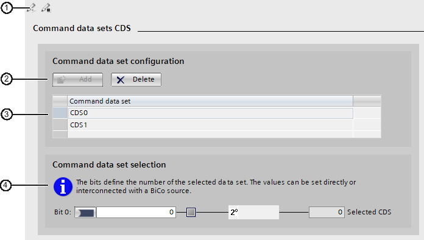
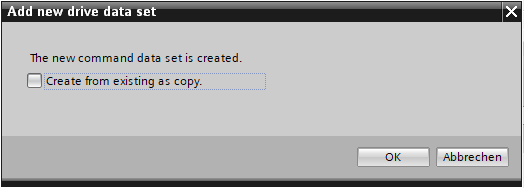
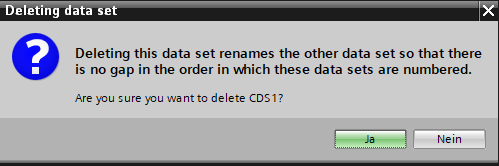
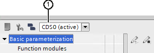

# SINAMICS S/G infeed units

This section contains information on the following topics:

- [Overview](#overview)
- [Parameterization](#parameterization)
- [Diagnostics](#diagnostics)

## Overview

### Infeed units (Line Modules)

Line Modules contain the central line infeed for the DC link. Various Line Modules can be selected to address the various application profiles:

- Active Line Modules (ALM)
- Basic Line Modules (BLM)
- Smart Line Modules (SLM)

The devices are parameterized in Startdrive using the "Infeed" drive object.

> **Note**
>
> **Use of the infeeds**
>
> Not all of the listed infeeds can be used by all Control Units. An assignment can be found at "Available components".

### Active Line Module

Active Line Modules can supply energy and return regenerative energy to the line supply. A Braking Module and braking resistor are required only if the drives need to be decelerated in a controlled manner after a power failure (i.e. when energy cannot be fed back to the line supply).

### Basic Line Module

Basic Line Modules are only suitable for infeed operation, i.e. they cannot feed regenerative energy back into the grid. If regenerative energy accrues, e.g. when braking the drives, it must be converted to heat via a Braking Module and a braking resistor.

### Smart Line Module

Smart Line Modules can supply energy and return regenerative energy to the line supply. A Braking Module and braking resistor are required only if the drives need to be decelerated in a controlled manner after a power failure (i.e. when energy cannot be fed back to the line supply). When a Smart Line Module is used as the infeed, the matching line reactor must be installed.

## Parameterization

This section contains information on the following topics:

- [Basic parameter assignment](#basic-parameter-assignment)
- [Technology Extensions](#technology-extensions)
- [Control logic](#control-logic)

### Basic parameter assignment

This section contains information on the following topics:

- [Function modules (infeed)](#function-modules-infeed)
- [Line data / operating mode](#line-data-operating-mode)
- [Enable logic](#enable-logic)
- [Line contactor control](#line-contactor-control)
- [Data sets](#data-sets)

#### Function modules (infeed)

You can connect various function modules for the associated deployed infeed. The function modules that can be activated (r0108) are listed in the "Function modules" screen form.

> **Note**
>
> You can only activate or deactivate function modules offline.

> **Note**
>
> The display of the function modules that can be activated is dynamic and depends on the selected infeed and the configuration of this infeed.

The usable function modules are presorted into two areas:

| Function module | Explanation | S120 | S150 | G150 | G130 |
| --- | --- | --- | --- | --- | --- |
| **Frequently used function modules** |  |  |  |  |  |
| Master/device (r0108.19) | Redundant operation of several ALMs on one DC link. | X | X | ‑ | ‑1) |
| Braking Module External (r0108.26) | In the parameter view, activates parameter range p3860…p3866 for the external Braking Modules. The corresponding parameters can only be parameterized in the parameter view. | X | X | X | ‑1) |
| **Other function modules** |  |  |  |  |  |
| Free function blocks (r0108.18) | In the parameter view, activates the parameters for the F blocks (p20030 … p20288). The free function blocks can only be parameterized in the parameter view. | X | X | X | ‑1) |
| Recorder (r0108.5) | Enables recording of fault events | X | X | X | ‑1) |
| Additional control (r0108.3) | For applications with asymmetrical line voltages: A negative sequence system current controller is used to balance the line currents and reduce the DC link ripple.   For applications with resonance effects in the current or the filter voltage (e.g. in systems with low short-circuit power rating): Freely parameterizable low-pass filters for resonance damping | X | X | ‑ | ‑1) |
| Line transformer (r0108.4) | For power generation applications: Magnetization of a transformer to limit the inrush current when the line system is connected. Compensation for direct current components and voltage drops on the transformer in conjunction with fault ride-through or line droop control. | X | X | ‑ | ‑1) |
| Fault ride-through (r0108.7) | For power generation applications in an interconnected system: Functions for fault ride-through and line monitoring (incl. active anti-islanding) according to power system guidelines. | X | X | ‑ | ‑1) |
| Cosine Phi add-on module (r0108.10) | Precise cos(Phi) determination of fundamental current and voltage components with BICO-interconnectable input variables (in contrast to the power factor r0038). | X | X | ‑ | ‑1) |
| Line droop control (r0108.12) | Installation, synchronization and operation of stand-alone systems: Control of line frequency and line voltage in single operation or together with other generators. | X | X | ‑ | ‑1) |
| 1) G130 does not use an infeed. |  |  |  |  |  |

In addition to the individual function modules, the purpose of use of each function module is described briefly.

##### Activating a function module

1. Activate the required function module by clicking the option.

   Repeat this for all other function modules that you want to activate.
2. Save the project to save the settings.

##### Additional parameters

---

#### Line data / operating mode

You set the most important parameters for the operation of an infeed in the function view of the "Line data / operating mode" screen form. The corresponding parameters are displayed depending on the infeed type and Control Unit.

| Setting | Explanation | ALM | SLM | BLM | S120 | S150 | G150 | G130 |
| --- | --- | --- | --- | --- | --- | --- | --- | --- |
| Device supply voltage | ‑ | x | x | x | x | x | x | ‑1) |
| DC-link voltage setpoint default setting | The value in this field (p3510) is determined automatically from the defined operating voltage. | x | x | ‑ | x | x | ‑ | ‑1) |
| Line supply / DC-link identification | If the line supply / DC-link identification has already been performed once, then the value is preset to "OFF". | x | x | ‑ | x | x | ‑ | ‑1) |
| Operating mode for ALM | The default of the operating mode depends on the operating voltage of the ALM:   &gt; 415 Veff = Unregulated Udc (Active Mode) active  ≤ 415 Veff = Regulated Udc (Active Mode) active | x | ‑ | ‑ | x | x | ‑ | ‑1) |
| 1) G130 does not use an infeed. |  |  |  |  |  |  |  |  |

##### Setting the line data and operating mode

The parameters are assigned default values when creating the device.

1. Enter a value for the device supply voltage in the "Device supply voltage" field (p0210).
2. To activate the line supply / DC-link identification, select the "On" option in the "Line supply / DC-link identification" drop-down list.

##### Selecting the operating mode for ALM

The operating mode depends on the motor voltage.

Example: The DC-link voltage must be lower in the USA. For this reason, you can switch the mode of an Active Line Module in order to be able to use it as a Smart Line Module (Smart Mode). With an operating voltage greater than 415 Vrms (ALM), you can set the operating mode in this screen form.

1. Set one of the two operating modes:

   - "Vdc non-regulated (Smart Mode)"

     In Smart Mode, the regenerative capability is maintained, but this results in a lower DC-link voltage compared to Active Mode. The DC-link voltage depends on the current supply voltage.
   - "Vdc regulated (Active Mode)"

     In Active Mode, the DC-link voltage is regulated to a settable setpoint (p3510) to produce a sinusoidal supply current (cos φ = 1). The size of the reactive current is also regulated and can be set specifically.

##### Additional parameters

---

#### Enable logic

You can connect several signal sources for the enables in the function view of the "Enable logic" mask.

##### Procedure

1. Connect the signal source via "p0840" for "OFF1 (low-active)".
2. Connect the 1st signal source via "p0844" for "Instantaneous OFF (OFF2) signal source 1".
3. Connect the 2nd signal source via "p0845" for "Instantaneous OFF (OFF2) signal source 2".
4. Connect the signal source via "p0852" for "Enable operation".

##### Additional parameters

---

#### Line contactor control

This function allows an external line contactor to be controlled. The closing and opening of the line contactor can be monitored by evaluating the feedback contact of the line contactor.

The line contactor can be controlled with the following drive objects via r0863.1:

- The infeed drive object
- The SERVO (high dynamic) and VECTOR (universal) drive objects

##### Parameterizing the switch-on delay and the monitoring time

This dialog shows the enable interconnection of the line contactor.

1. Enter the switch-on delay for the control command of a power unit or line contactor in the "Power unit/switch-on delay" (p0862) field.
2. Enter in the "Line contactor/monitoring time" (p0861) field, the monitoring time of the line contactor.  
   The monitoring time starts for each switching operation of the line contactor (r0863.1). If no feedback from the line contactor is detected within this time, a message is issued.
3. Interconnect the signal source for "Line contactor feedback" (p0860).

   Use for activated monitoring (BI: p0860 not equal r0863.1), the BO: r0863.1 signal of the dedicated drive object for controlling the line contactor.
4. Interconnect the signal sink for "Control contactor (r0863.1)".

##### Function diagrams (FD)

Basic Infeed - Sequencer - 8732 -

Smart Infeed - Sequencer - 8832 -

Active Infeed - Sequencer - 8932 -

##### Additional parameters

---

#### Data sets

This section contains information on the following topics:

- [Fundamentals](#fundamentals)
- [Structure of the data set screen form](#structure-of-the-data-set-screen-form)
- [Managing a command data set (CDS)](#managing-a-command-data-set-cds)
- [Activating or editing data sets](#activating-or-editing-data-sets)
- [Switching data sets](#switching-data-sets)

##### Fundamentals

###### Overview

For many applications it is beneficial if multiple parameters can be changed simultaneously by means of an external signal during operation or when the system is ready for operation. This can be carried out with the aid of indexed parameters. For the purpose of this function, the parameters have been combined in such a way that they form groups or data sets and are indexed. By using the indexing, several different settings can be stored for each parameter and activated by changing the data set (i.e. switching back and forth between the data sets).

Those parameters (connector and binector inputs) that are used to control the converter and enter a setpoint are assigned to the command data set (CDS).

You can configure the data sets for each drive within a project:

- You create the corresponding components in the device configuration.
- You configure the available data sets in Startdrive while creating new data sets or deleting existing data sets.

###### Function diagrams (FD)

- Data sets - Command data sets (CDS) - 8560 -

###### Parameters

- p0170
- p0809
- p0810
- p0811

---

---

**See also**

Rules for using data sets
  
Data set definitions

##### Structure of the data set screen form

###### Structure of the data set screen forms

| Symbol | Meaning |
| --- | --- |
| ① | Icons for editing/activating DDS drive data sets in online mode. Not relevant for CDS. |
| ② | Two buttons in the active data set screen form enable the insertion and deletion of individual data sets of the list. |
| ③ | List of created command data sets. The created data sets are numbered chronologically. |
| ④ | Working area for activating a selected data set via BICO interconnections. |

Example: Screen form for command data sets

###### Icons for editing data sets in the online mode

The editing mode must be activated first in order to edit data sets in the online mode. The editing mode is not required in the offline mode.

| Icon | Description |
| --- | --- |
|  | Startdrive is not online.   You can only edit the data sets offline. |
|  | Startdrive is online.   The editing mode is not activated yet. |
|  | Startdrive is online.   The editing mode is active. |

##### Managing a command data set (CDS)

###### Overview

You can edit the command data sets of the drive via the "Command data sets (CDS)" screen form. The following CDS can be edited at most:

- 2 CDS for infeeds
- 2 CDS for SERVO drives
- 4 CDS for VECTOR drives

###### Requirements

- At least 1 CDS exists (for Line Module, Power Module, or Motor Module).
- The basic parameterization of an infeed or a drive axis has been opened in the secondary navigation.
- Creating and deleting CDSs: There is no online connection to the drive.

  CDSs can only be created or deleted offline. However, CDSs can be activated online.

###### Creating a new command data set (CDS)

1. Click "Add".

   The "Add new command data set" dialog box opens.

   

   

   Adding a CDS
2. Make sure that the "Create as copy" option is deactivated.
3. Click "OK" in the dialog box.

**Result**

A new command data set is created in the list.

###### Creating a new CDS with contents from other CDSs

1. Click "Add".

   The "Add new command data set" dialog box opens.

   

   

   Adding a CDS
2. Activate the "Create as copy" option.
3. Click "OK" in the dialog box to confirm your selection.

**Note**

**Special case for VECTOR drives**

If more than 2 CDS are available for VECTOR drives, you can select at this point which available CDS should be copied.

**Result**

The new command data set is created from the selected template and also inserted in the last position of the list of command data sets.

###### Deleting a command data set (CDS)

In order for command data sets to be deleted, at least 2 CDS (for servo drives or infeed) or 3 CDS (for vector drives) must be available in the list.

1. Select the CDSs to be deleted in the list of command data sets.

   The CDS is displayed again in detail in a worklist located below the collective list.
2. Click "Delete".

   A confirmation prompt is displayed.

   

   

   Deleting a CDS
3. Click "OK" to delete the data set.

**Result**

The CDS is deleted from the list of command data sets. The subsequent CDSs in the list will be renumbered if necessary. The numbering of the CDSs is always chronological. The last available CDS remains and cannot be deleted.

##### Activating or editing data sets

###### Overview

Several data sets of a data set type must be created for a data set switchover.

###### Editing offline

To assign the settings of a drive to a data set, proceed as follows:

1. Open the configuration screen form for the desired data set type (e.g. the screen form for the drive data set).
2. Select the required data set from the list of data sets.
3. Change the signal sources of the BICO interconnections at the bottom of the working area.
4. Save your settings permanently.

**Result:**

Specific parameterizations are available for each of the various data sets.

###### Editing online

The editing mode must be active in order to edit data sets in the online mode.   
To assign the settings of a drive to a data set, proceed as follows:

1. Click the  icon to start the editing mode.
2. Open the configuration screen form for the desired data set type (e.g. the screen form for the drive data set).
3. Select the required data set from the list of data sets.
4. Change the signal sources of the BICO interconnections at the bottom of the working area.
5. Save your settings permanently.
6. Click the  icon to quit the editing mode on completing the settings.

**Result:**

Specific parameterizations are available for each of the various data sets.

##### Switching data sets

###### Overview

You can switch between different data sets in the configuration screen forms. The switchover is performed via the drop-down list in the toolbar.

| Symbol | Meaning |
| --- | --- |
| ① | Shows the active command data set (CDS). Enables switchover to a different data set. |

Data set switchover

###### Requirement

- Multiple command data sets have been created.

  If only one data set has been created, the drop-down list for switchover is deactivated.

###### Procedure

1. Open the required configuration screen form.

   The drop-down list for data set switchover shows the active data set. The settings of this data set are shown in the screen form below it.
2. Select another data set from the drop-down list for the data set switchover.
3. Change the signal sources of the BICO interconnections at the bottom of the working area.

###### Result

In the screen form, all data-set-dependent settings are changed to the values of the selected data set (if these values are configured differently).

### Technology Extensions

This section contains information on the following topics:

- [Adding and activating Technology Extensions](#adding-and-activating-technology-extensions)

#### Adding and activating Technology Extensions

##### "Technology Extensions that can be activated for this drive object" view - Current drive object

This tabular overview shows all installed Technology Extensions that are compatible with the drive object currently selected via the project tree for parameterization.

The overview has the following structure:

| Column | Description |
| --- | --- |
| Name | The name of the Technology Extension is displayed here. |
| Usage | Click the "Usage" button to change to the "Current drive object" view of the associated drive object. |
| Selection | Click the "Selection" option to activate or deactivate the Technology Extension for the current Startdrive project. |
| Version | The version of the Technology Extension is displayed here. |
| Info | Click the "Details" button to obtain more information on the Technology Extension. |

##### "Technology Extensions that cannot be activated" view - Current drive object

The "Technology Extensions that cannot be activated" overview is visible only if you select the "Current drive object" option in the drop-down list just to the right of the "Add further Technology Extensions..." button.

This tabular overview shows all installed Technology Extensions that are incompatible with the drive object currently selected via the project tree for parameterization.

The overview has the following structure:

| Column | Description |
| --- | --- |
| Name | The name of the Technology Extension is displayed here. |
| Reason | The reason why the Technology Extension is not compatible with the current drive object is displayed here. Click the button to obtain more information about why the Technology Extension is not compatible with the drive object. |
| Version | The version of the Technology Extension is displayed here. |
| Required FW version | The minimum SINAMICS firmware version required to use the Technology Extension is displayed here. |
| Existing FW version | The SINAMICS firmware version of the current drive object is displayed here. |
| Uninstall | Click the "Remove" button to uninstall the Technology Extension. |
| Info | Click the "Details" button to obtain more information on the Technology Extension. |

##### "Technology Extensions that can be activated for this drive unit" view - All drive objects

This tabular overview shows all of the installed Technology Extensions which you have added for the currently selected drive.

The overview has the following structure:

| Column | Description |
| --- | --- |
| Name | The name of the Technology Extension is displayed here. |
| Usage | Click the "Usage" button to change to the "Current drive object" view of the associated drive object. |
| Selection | Click the "Selection" option to activate or deactivate the Technology Extension for the current Startdrive project. |
| Version | The version of the Technology Extension is displayed here. |
| Parameter number range | The parameters that are relevant for the Technology Extension are displayed here. |
| Uninstall | Click the "Remove" button to uninstall the Technology Extension. |
| Info | Click the "Details" button to obtain more information on the Technology Extension. |

##### Requirements

- A project has been created, or an existing project is open.
- The device configuration contains one of the following SINAMICS drives:

  - SINAMICS S120 (as of firmware version 5.2)
  - SINAMICS MV (as of firmware version 5.2.1)

##### Changing views

To switch to the display of the "Technology Extensions" function view, proceed as follows:

1. In the drop-down list located just to the right of the "Add further Technology Extensions..." button, select the option "Current drive object".  
   The "Technology Extensions" function view now contains two overview tables:

   - "Technology Extensions that can be activated for this drive object"
   - "Technology Extensions that cannot be activated"
2. In the drop-down list located just to the right of the "Add further Technology Extensions..." button, select "All drive objects".  
   The "Technology Extensions" function view now contains only the overview table "Technology Extensions that can be activated for this drive object".

##### Adding Technology Extensions

Proceed as follows to add a Technology Extension to your Startdrive project:

1. Click the "Add further Technology Extension..." button.  
   A dialog opens.
2. In the file system of your PC, select the desired Technology Extension file (file extension *.tec) and click "Open".  
   The Technology Extension is added to your Startdrive installation.  
   Depending on the currently selected view and the compatibility with the current drive object, the Technology Extension is displayed in one of the tabular overviews.

**Note**

When you add a Technology Extension, it is available to you in your current Startdrive installation across all projects.

##### Activating Technology Extensions

To activate a Technology Extension, proceed as follows:

1. Add a Technology Extension to your project as described in the section "Adding Technology Extensions".
2. In the drop-down list located just to the right of the "Add further Technology Extensions..." button, select the required "Technology Extensions" function view from the drop-down.
3. Activate the option "Selection" in the corresponding row of the desired drive object located in the column of the tabular overview with the same name.

##### Deactivating Technology Extensions

To deactivate a Technology Extension, proceed as follows:

1. In the drop-down list located just to the right of the "Add further Technology Extensions..." button, select the required "Technology Extensions" function view from the drop-down.
2. Deactivate the option "Selection" in the corresponding row of the desired drive object located in the column of the tabular overview with the same name.

##### Uninstalling Technology Extensions

You can uninstall Technology Extensions globally via the "All drive objects" view or in the "Technology Extensions that cannot be activated" overview of the respective drive object.

Proceed as follows to remove a Technology Extension from your Startdrive project:

1. Open the "All drive objects" view or the "Technology Extensions that cannot be activated" overview of the desired drive object.
2. Click the "Remove" button in the row of the drive object concerned in the "Uninstall" column.

   The "Remove Technology Extension" dialog opens.
3. Click "Yes" to confirm the uninstallation of the Technology Extension.
4. If the Technology Extension is still activated on drive objects in the project, the "Remove Technology Extension" dialog opens again.  
   All drive objects on which the Technology Extension is still activated are listed.  
   Click "Yes" to uninstall the Technology Extension.

##### Additional information

You can find additional information on the Technology Extensions in the SIOS portal on the Internet.

---

**See also**

[SIOS Technology Extension](https://support.industry.siemens.com/cs/ww/en/ps/13231)

### Control logic

#### Definition

The connections for the control and status words are displayed for the infeed in the "Control logic" screen form. You can edit these connections:

The connections for the control and status words are arranged in groups. The connections of a group can be displayed in the screen form via two drop-down lists on the left and on the right. Connections can be displayed for the following groups:

- Control word sequence control infeed
- Control word faults/alarms
- Status word sequence control infeed
- Status word faults/alarms 1
- Status word faults/alarms 2
- Infeed status word
- Missing enables

An illuminated LED display means that the corresponding bit of the control or status word is set. If the bit value of the control or status word results from the logical connection of several signal sources, the type of the logical connection is displayed by the associated logic symbol.

#### Selecting and connecting control and status words

1. Select the desired group of control and status words in the drop-down list (on the left or right in the screen form).

   The corresponding display and connection fields are displayed on the side of the screen form on which you made the setting in the drop-down list.
2. Interconnect the signal sources for the displayed parameters (for control words) or the bits (for status words and missing enables).

#### Function diagrams (FD)

Internal control/status words - Control word sequence control - 2501 -

Internal control/status words - Status word sequence control - 2503 -

Internal control/status words - Control word speed controller - 2520 -

Internal control/status words - Status word speed controller - 2522 -

Internal control/status words - Status word current control - 2530 -

Internal control/status words - Control word faults/alarms - 2546 -

#### Additional parameters

- p0840
- p0844
- p0845
- p0852
- p3532
- p3533
- p0854
- p2103
- p2104
- p2105
- p2112
- p2116
- p2117
- p2106
- p2107
- p2108
- r0899 (various bits)
- r2139 (various bits)
- r0046 (various bits)

---

## Diagnostics

This section contains information on the following topics:

- [Missing enables](#missing-enables)
- [Status parameters](#status-parameters)
- [Control/status words](#controlstatus-words)
- [Communication](#communication)

### Missing enables

#### Definition

The infeed does not change to the "Operation" state until all the enables are present. In the "Missing enables" mask, the LEDs in the function view indicate which enables are still missing. An illuminated LED display indicates that the corresponding enable is missing.

The bits of the missing enables (r0046) are displayed in the mask.

#### Additional parameters

---

### Status parameters

The status parameters with the associated numeric values are displayed in the function view in the "Status parameters" mask:

| Column | Meaning of the instruction |
| --- | --- |
| Number | Number of the parameter. |
| Parameter text | Entire parameter text in long form. |
| Value | Numeric value of the parameter. This numeric value can be changed as follows:   | Symbol | Meaning | | --- | --- | | 1. Click the table cell. 2. Enter the numeric value of the parameter and press the Enter key. Values outside the value range are not accepted and the original value is entered automatically. |  | |
| Unit | Unit of the parameter. |

### Control/status words

This section contains information on the following topics:

- [Displaying control/status words](#displaying-controlstatus-words)
- [Control/Status Words Meaning](#controlstatus-words-meaning)

#### Displaying control/status words

##### Definition

The control and status words are displayed in the function view for diagnostic purposes in the "Control/status words" mask. The mask is split into two vertical sections each displaying a group of control and status words via a drop-down list.

The following groups can be displayed:

- Control word sequence control infeed (r0898)
- Status word sequence control infeed (r0899)
- Control word faults/alarms (r2138)
- Status word faults/alarms 1 (r2139)
- Status word faults/alarms 2 (r2135)
- Infeed status word (r3405)

##### Selecting a group of control and status words

1. Select the desired group of control and status words in one of the three drop-down lists.

   The corresponding display and connection fields are displayed on the side of the mask on which you made the setting in the drop-down list.

   An illuminated LED display means that the appropriate bit of the control or status word is set.
2. If you want to display the values of several groups next to one another, set the other desired groups in the other two drop-down lists

##### Function diagrams (FD)

Active Infeed - Control word sequence control infeed - 8920 -

Active Infeed - Status word sequence control infeed - 8926 -

Active Infeed - Status word infeed - 8928 -

Internal control/status words - Control word faults/alarms - 2546 -

Internal control/status words - Status word faults/alarms 1 and 2 - 2548 -

Basic Infeed - Control word sequence control infeed - 8720 -

Basic Infeed - Status word sequence control infeed - 8726 -

Smart Infeed - Control word sequence control infeed - 8820 -

Smart Infeed - Status word sequence control infeed - 8826 -

Smart Infeed - Status word infeed - 8828 -

Smart Infeed - Signals and monitoring functions, line voltage monitoring - 8860 -

##### Additional parameters

---

#### Control/Status Words Meaning

Active Infeed control words

| Signal name | Internal control word | Binector input | Internal control word display | PROFIBUS telegram 370 |
| --- | --- | --- | --- | --- |
| ON/OFF1 | STWAE.0 | p0840 ON/OFF2 | r0898.0 | A_STW1.0 |
| OFF2 | STWAE.1 | p0844 1 OFF2 and p0845 2 OFF2 | r0898.1 | A_STW1.1 |
| Operation enable | STWAE.3 | p0852 Enable operation | r0898.3 | A_STW1.3 |
| Disable motor operation | STWAE.5 | p3532 Disable motor operation | r0898.5 | A_STW1.5 |
| Inhibit regenerating | STWAE.6 | p3533 Disable regenerative operation | r0898.6 | A_STW1.6 |
| Acknowledge error | STWAE.7 | p2103 1 Acknowledge  or p2104 2 Acknowledge  or p2105 3 Acknowledge | r2138.7 | A_STW1.7 |
| Control by PLC | STWAE.10 | p0854 Control by PLC | r0898.10 | A_STW1.10 |

Active Infeed status message

| Signal name | Internal control word | Parameter | PROFIBUS telegram 370 |
| --- | --- | --- | --- |
| Ready for power-up | ZSWAE.0 | r0899.0 | A_ZSW1.0 |
| Ready to operate | ZSWAE.1 | r0899.1 | A_ZSW1.1 |
| Operation enabled | ZSWAE.2 | r0899.2 | A_ZSW1.2 |
| Fault active | ZSWAE.3 | r2139.3 | A_ZSW1.3 |
| No OFF2 active | ZSWAE.4 | r0899.4 | A_ZSW1.4 |
| Power-on inhibit active | ZSWAE.6 | r0899.6 | A_ZSW1.6 |
| Warning present | ZSWAE.7 | r2139.7 | A_ZSW1.7 |
| Controlled by PLC | ZSWAE.9 | r0899.9 | A_ZSW1.9 |
| Pre-charging completed | ZSWAE.11 | r0899.11 | A_ZSW1.11 |
| Line contactor closed feedback | ZSWAE.12 | r0899.12 | A_ZSW1.12 |

##### Additional parameters

---

### Communication

This section contains information on the following topics:

- [S120 infeed telegrams receive direction](#s120-infeed-telegrams-receive-direction)
- [S120 infeed telegrams send direction](#s120-infeed-telegrams-send-direction)
- [PZD send/receive direction diagnostics](#pzd-sendreceive-direction-diagnostics)

#### S120 infeed telegrams receive direction

##### Description

Here you specify the interconnections of the PROFIdrive telegram in the receive direction for infeeds.

Use the telegram configuration () to change the configuration of the telegrams or add telegram extensions.

**Telegram structure**

The interconnections for the process data in the receive direction are created automatically for the standard and manufacturer-specific telegrams.

If you select the Free telegram configuration, you can freely define the interconnections for the process data in the receive direction.

Only those telegrams available for the drive object are offered. The interconnections of the control words or receive words have already been created.

| Symbol | Meaning |
| --- | --- |
|  | Click the button next to "Interconnections" to interconnect the signal for the connector output. |
|  | Click the button to display and interconnect the signal bit by bit. |

The following information of the displayed telegrams is displayed:

| Telegram type | PZD | Display of the value | Format switchover | Control words | Interconnections |
| --- | --- | --- | --- | --- | --- |
|  | The numbering and arrangement of the process data. | Value of the process data (PZD) | Switching the value of the process data to a different display (hex, bin, dec). | List of the control words that are transmitted in the telegram. | Display or interconnection of the parameter with which the signal is to be interconnected. Several interconnections are possible. |
| PROFIdrive  370, 371 | X | X | X | X | X |
| Telegram extension | X | X | X | X | X |

##### S120 function diagrams (FD)

- PROFIdrive - Manufacturer-specific telegrams and process data 1 - 2419 -
- PROFIdrive - Manufacturer-specific telegrams and process data 2 - 2420 -
- PROFIdrive - Manufacturer-specific telegrams and process data 3 - 2421 -
- PROFIdrive - Manufacturer-specific telegrams and process data 4 - 2422 -
- PROFIdrive - E_ZSW1_BM status word infeed metal industry interconnection - 2430 -
- PROFIdrive - E_STW1 control word infeed interconnection - 2447 -
- Basic Infeed - Control word sequence control infeed - 8720 -
- Basic Infeed - Status word sequence control infeed - 8726 -
- Smart Infeed - Control word sequence control infeed - 8820 -
- Smart Infeed - Status word sequence control infeed - 8826 -
- Smart Infeed - Status word infeed - 8828 -
- Active Infeed - Control word sequence control infeed - 8920 -
- Active Infeed - Status word sequence control infeed - 8926 -
- Active Infeed - Status word infeed - 8928 -

#### S120 infeed telegrams send direction

##### Description

Here you specify the parameters of the PROFIdrive telegram in the send direction for infeeds.

Use the telegram configuration () to change the configuration of the telegrams or add telegram extensions.

**Telegram structure**

The interconnections for the process data in the send direction are created automatically for the standard and manufacturer-specific telegrams.

If you select the Free telegram configuration, you can freely define the interconnections for the process data in the send direction.

| Symbol | Meaning |
| --- | --- |
|  | Click the button next to "Interconnections" on the left to interconnect the signal for the connector input. |

The following information of the displayed telegrams is displayed:

| Telegram type | Interconnections | Status words | Value | Format switchover | PZD |
| --- | --- | --- | --- | --- | --- |
|  | Display or interconnection of the parameter with which the signal is to be interconnected or is interconnected. | List of the status words that are transmitted in the telegram. | Value of the process data (PZD) | Switching the value of the process data to a different display (hex, bin, dec). | Numbering and arrangement of the process data. |
| PROFIdrive  370, 371 | X | X | X | X | X |
| Telegram extension | X | X | X | X | X |

##### S120 function diagrams (FD)

- PROFIdrive - Manufacturer-specific telegrams and process data 1 - 2419 -
- PROFIdrive - Manufacturer-specific telegrams and process data 2 - 2420 -
- PROFIdrive - Manufacturer-specific telegrams and process data 3 - 2421 -
- PROFIdrive - Manufacturer-specific telegrams and process data 4 - 2422 -
- PROFIdrive - E_ZSW1_BM status word infeed metal industry interconnection - 2430 -
- PROFIdrive - E_STW1 control word infeed interconnection - 2447 -
- Basic Infeed - Control word sequence control infeed - 8720 -
- Basic Infeed - Status word sequence control infeed - 8726 -
- Smart Infeed - Control word sequence control infeed - 8820 -
- Smart Infeed - Status word sequence control infeed - 8826 -
- Smart Infeed - Status word infeed - 8828 -
- Active Infeed - Control word sequence control infeed - 8920 -
- Active Infeed - Status word sequence control infeed - 8926 -
- Active Infeed - Status word infeed - 8928 -

#### PZD send/receive direction diagnostics

##### Description

You can display a diagnosis of the status or control words of the selected telegram here.

##### Function diagrams (FD)

- PROFIdrive - Manufacturer-specific telegrams and process data 1 - 2419 -
- PROFIdrive - Manufacturer-specific telegrams and process data 2 - 2420 -
- PROFIdrive - Manufacturer-specific telegrams and process data 3 - 2421 -
- PROFIdrive - Manufacturer-specific telegrams and process data 4 - 2422 -
- PROFIdrive - E_ZSW1_BM status word infeed metal industry interconnection - 2430 -
- PROFIdrive - E_STW1 control word infeed interconnection - 2447 -
- Basic Infeed - Control word sequence control infeed - 8720 -
- Basic Infeed - Status word sequence control infeed - 8726 -
- Smart Infeed - Control word sequence control infeed - 8820 -
- Smart Infeed - Status word sequence control infeed - 8826 -
- Smart Infeed - Status word infeed - 8828 -
- Active Infeed - Control word sequence control infeed - 8920 -
- Active Infeed - Status word sequence control infeed - 8926 -
- Active Infeed - Status word infeed - 8928 -
